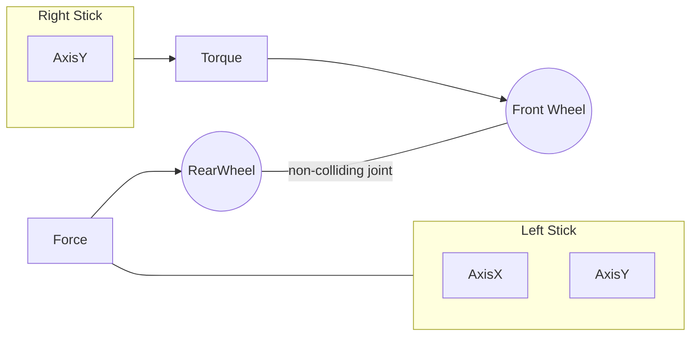

# WaMBaM
#### (ty ma'am)

## Made with Love2D

### Dedicated to the LOML

## Basic Controls

The *left stick* controls the rear wheel in all directions, through `force`. The *right stick* controls the `torque` applied through the front wheel. More is planned, but feel 
free to attempt mastering these basic controls while the
remaining mechanics and mappings are completed. Have fun and good luck!

## Goals

Also still in production are the `goals`. The goal of the game is to win by scoring more goals than the opponent. The `goals` are to be offset from the floor. Everyone 
will need to either get lucky enough to score, or learn enough mechanics to get the `ball` off of the floor and into their opponent's goal.  Your approach to get the ball off of the floor and intothe goal will be up to you. How your opponents approach the same task will likely differ. Perhaps you can learn from one another.

## Basic Mechanics

Noting that this is a minimal set of bits of knowledge, take note of the following:

1. You'll not be able to get airborne using input from a single stick. Well, perhaps you can, but not easily, from a standstill.  
2. Applying Forces to one wheel will affect your ability to apply forces through the other wheel. Of course, you can and are meant to use both inputs to maneuver, but to have full control, you'll want to study and experiment some.
3. Full control is not meant to really be achievable. At least at some points, your movement through the arena can only be described as "Que sera, sera" until you hit a wall, or the floor, or get lucky in getting reorientated. 