# WaMBaM

(ty ma'am)

## Made with Love2D

## Build

a `build.sh` script is provided for building release binaries for Windows & Linux. Build script output can be found in the `release` folder.

## Basic Controls

### Current Controls (WIP)

#### Input Diagram

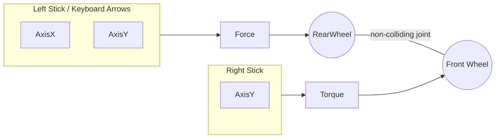

#### Input Table

| Input | Action |
| ----- | ------: |
| Controller | |
| left stick | apply `force` through `rear 'wheel'` |
| right stick | apply `torque` through `front 'wheel'` |
| right trigger | apply `brake` through `front 'wheel'` |
| left trigger | increase `force` through `rear 'wheel'` |
| Keyboard | |
| directional keys | apply `force` through `rear 'wheel'` |

More is planned, but feel free to attempt mastering these basic controls while the remaining mechanics and mappings are completed. Have fun and good luck!

## Goals

Also still in production are the `goals`. The goal of the game is to win by scoring more goals than the opponent. The `goals` are to be offset from the floor, and to be unscorable from below; otherwise, the design(s) is/are in progress. Candidate designs include:

- `Buckets` - eg. the game plays a bit like "hoops".
- `Narrow Openings` - eg. the game plays like "aerial hockey".
- `Buttons` - eg. the goals are large, thin, reactionary, with points scored based on hit force (and no ball reset).
  
Most players will need to either get lucky enough to score, or will need to learn enough mechanics to get the `ball` off of the floor and into their opponent's goal consistently. Your approach to get the ball off of the floor and into the goal will be up to you. How your opponents approach the same task will likely differ. Perhaps you can learn from one another.

## Basic Mechanics

Noting that this is a minimal set of bits of knowledge, take note of the following:

1. You'll not be able to get airborne using input from a single stick. Well, perhaps you can, but not easily, from a standstill.  
2. Applying Forces to one wheel will affect your ability to apply forces through the other wheel. Of course, you can and are meant to use both inputs to maneuver, but to have full control, you'll want to study and experiment some.
3. Full control is not meant to really be achievable. At least at some points, your movement through the arena can only be described as "Que sera, sera" until you hit a wall, or the floor, or get lucky in getting reorientated.

### Current Named Mechanics List

(subject to change)

| Img | Name | Description |
| --- | ---- | --------- |
| 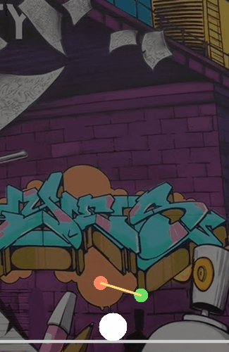 | Carry | Place the ball above the WaM'er and lift it off of the ground, balancing as the ball keeps steady contact with the WaM'er (rear 'wheel') |
| 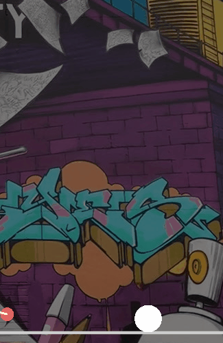 | WaM | Hit the ball with sufficient force using the rear 'wheel' |
| 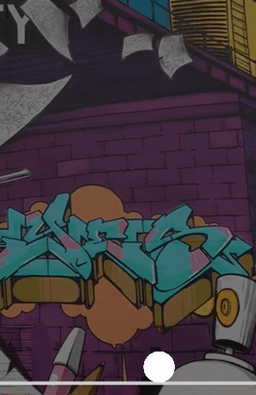 | BaM | Hit the ball with sufficient force using the front 'wheel' |
| 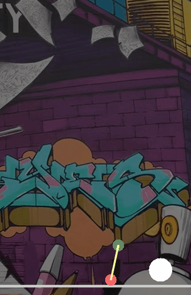 | WaMBaM | Transition from Carrying or from a WaM into a BaM |

## TODOs

### Kanban

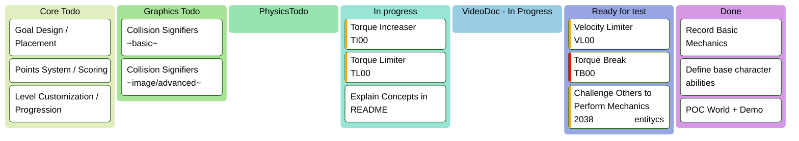

### Controls (basic)

| Kanban Code | Description | Priority |
| ------ | ------------- | ---------- |
| FTB00 | Force/Torque Brake: An input which brings  velocity to a stop over time | `Highest` |
| TI00 | Torque Increaser: An input which increases the torque applied on the front wheel | `Medium` |
| TL00 | Torque Limiter: Internal default torque limit when no Increaser input is given | `High` |
| FTB00 | Torque/Force Breaking (per handle) | `High` |

### Interaction Signifiers

todo: some/any kind of pixel filter applied based on visuals/interactions

| Kanban Code | Description | Priority |
| ------ | ------------- | ---------- |
| ISB00 | Backdrop: Planned `'arena'` backdrops are local street art (credited placeholders until then) | `Highest` |
| ISI00 | WaMBaM Interactions: Graffiti-like WaM / BaM for respective colliders (rear/front) | `Medium` |
| ISS00 | Signifier for when player breaks the 'proposed speed / torque limits' | `Low` |

## Files

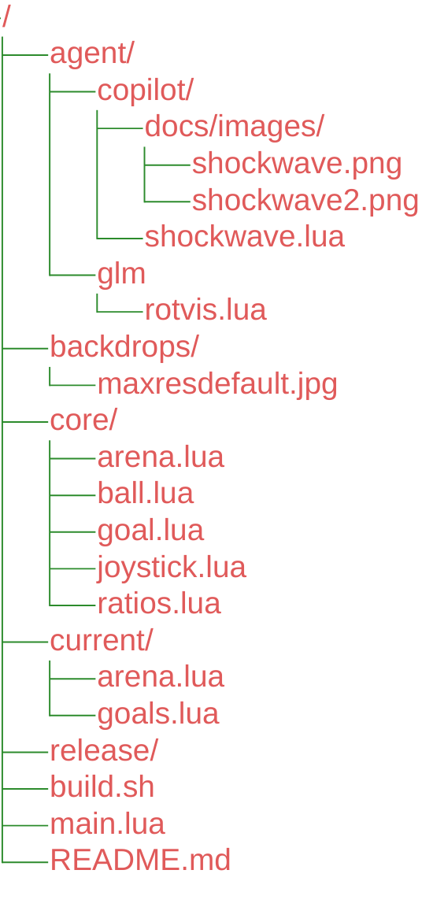

### README.md

- `you are`***`here`***

### main.lua

- Main script
  - All game logic leads from here.
  - Gets required tables / types.
  - Defines main callbacks.
  - Calls load, update, and/or draw methods of instantiated or referenced objects.
  
### build.sh

- Build from linux / wsl
  - Produces .exe and .love executables.
  - Attempts to copy windows dlls from `c:/Program Files/LOVE/`
    - Alternatively, copy them manually from your local install location to the `release/` folder.

### release/

- ==Build script target location==.
  
### core/

- ==Holds files handling core, static settings / setup==.

#### core/arena.lua

- Sets up the core arena items, which might include goals, floor, walls, etc.
  
> &nbsp;
> **Arena** (the same as many other returned objects) is returned with callable **`load`**, **`update`**, and **`draw`** methods, meant to coincide with the global lifecycle.
>
> ```mermaid
> flowchart LR
>   subgraph M[main.lua]
>     load
>     update
>     draw
>   end
>   subgraph J["core/arena.lua"]
>     subgraph J1["Arena"]
>     load1["load"]
>     update1["update"]
>     draw1["draw"]
>     end
>   end
>   J1 -->|= require| M
>   load --> load1
>   update --> update1
>   draw --> draw1
> ```
>
> *Expected arguments may differ*
> &nbsp;

==Note==: The same require | mirror-lifecycle pattern is used for `JoystickInput`, `Ball`, `Arena`, `CurrentArena` (current/arena.lua) and `any new 'objects' added going forward` where applicable.  I will refrain from posting the same diagram with different names, and slim down class diagrams in the same spirit.

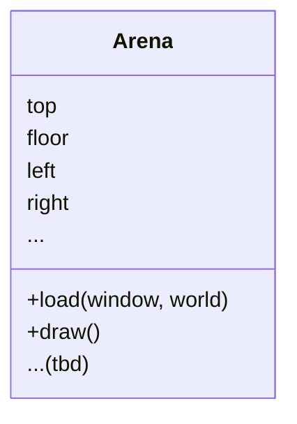

#### core/ball.lua

- Handles creation, updates, display, and other core behavior for the ball.
  
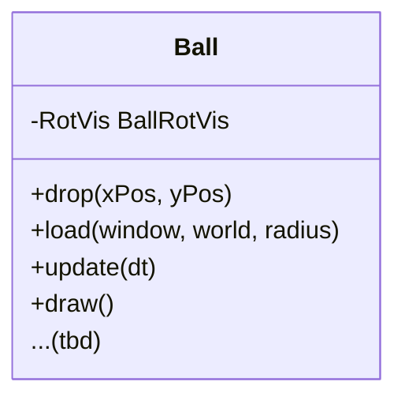

#### core/contact.lua

- Handles world collisions 
- Pub/Sub pattern allowing for adding/removing callbacks
  - implemented for `begin` callback only initially.
  - other callbacks will be implemented here if necessary, alongside the `begin` table.

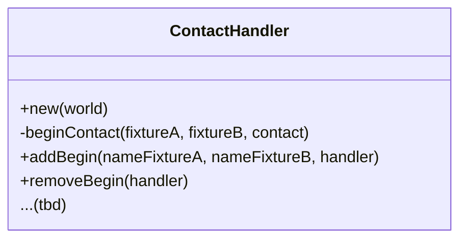

#### core/goal.lua

- Defines a default Goal type

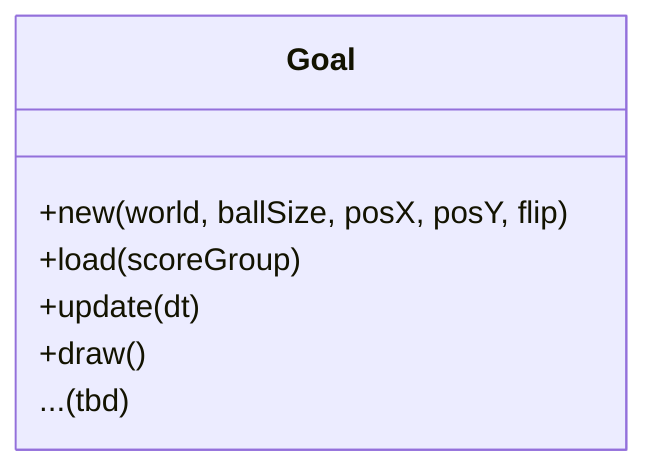

#### core/joystick.lua

- Handles setup, updates, and drawing related to joystick input.

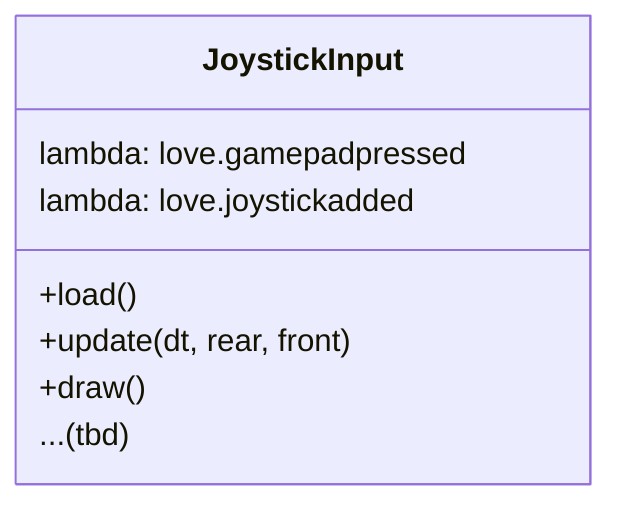

#### core/ratios.lua

- Used to provide relative values for influenced physics/geometry constraints.
- Provides functions taking taking values from the base control; `rear 'wheel'` as input, and yielding relative values for related components.
  - eg., changing `'wheel' size` should change `ball size` such that `carrying` and other mechanics resume working as expected / required.
  
> &nbsp;
> **Ratio** Class
>
>```mermaid
>classDiagram
>  class Ratios{
>    +BallSize(rearWheelSize)
>    +FrontWheelMass(rearWheelMass)
>    +FrontWheelGravityScale(rearWheelGravityScale)
>    +FrontWheelTorque(rearWheelForce)
>    ...(tbd)
>  }
>```
>
> &nbsp;
> **Ratio** input/output flow
>
> ```mermaid
> flowchart LR
>   subgraph M["main.lua"]
>     R["`**rear**`"]
>     F["`**front**`"]
>     B["`**ball**`"]
>   end
>   C@{ shape: docs, label: "core/ratios.lua"}
>   R -->|physics, geometry| C -->|physics, geometry| F & B
> ```

### current/

- Holds logic concerned with the current game / round ==**(volatile)**==.

#### current/arena.lua

- Loads the arena background / other temporary arena settings
  
#### current/goals.lua

- Loads and places initial goal examples (eg. the high difficulty default)
  
> &nbsp;
> ***Image**: ball sitting in red goal with white edges*
>
> 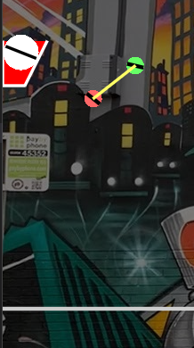
>

- Alternatively, custom / other goal types are planned.

#### lib/

- ==Third Party Libraries==

#### agent/

- ==Resources (code, images, etc.) created with the help of AI, per model/service.  See `README` files per folder for more details==.
  
## Credits

- `todo`
  
### Further Acknowledgements

`Dedicated to the LOML`
