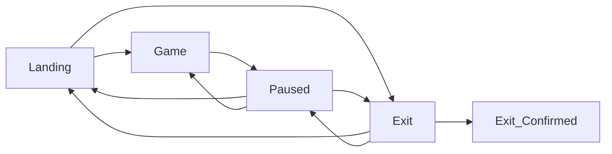
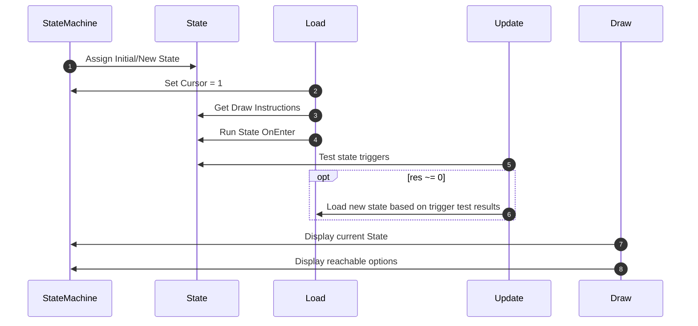

# In Development / Ideas

## Menu States 


>
>```mermaid
>flowchart LR
>Landing:::Current --> Game:::Next & Exit:::End
>Game --> Paused
>Paused --> Exit & Landing & Game
>Exit --> Exit_Confirmed & Landing & Paused
>
>classDef Current fill:black,color:white
>classDef Next fill:aqua,color:black
>classDef End fill:#f28,color:#efe
>```
>
>State machine has no notion of Paused from this state
>&nbsp;

>
>```mermaid
>
>flowchart LR
>Landing --> Game:::Current & Exit
>Game --> Paused:::Next
>Paused --> Exit & Landing & Game
>Exit --> Exit_Confirmed & Landing & Paused
>
>classDef Current fill:black,color:white
>classDef Next fill:aqua,color:black
>```
>
>State Machine only knows paused state as reachable
>&nbsp;


>```mermaid
>flowchart LR
>Landing --> Game & Exit:::End
>Game --> Paused:::Current
>Paused --> Exit & Landing:::Next & Game:::Next
>Exit --> Exit_Confirmed & Landing & Paused
>
>classDef Current fill:black,color:white
>classDef Next fill:aqua,color:black
>classDef End fill:#f28,color:#efe
>```
>
>Maximum # of options available when paused. Exit state has onTest defined as no-op, as there are no further states reachable. Hence `nodes = {}`, `text = {}`, `onTest = {}`. Only title and `onEnter` are useful.
> &nbsp;

>
> ```mermaid
> flowchart TB
> Landing e1@-->|1 - Play| Game
> Landing -->|2| Exit
> Game --> Paused
> Paused e2@-->|1 - Resume| Game
> Paused -->|2 - Main Menu| Landing
> Paused -->|3| Exit
> Exit e3@-->|1 - Yes| Exit_Confirmed
> Exit ep1@-->|"2 - previous (No)"| Landing 
> Exit ep2@-->|"2 - previous (No)"| Paused
> Cursor .->|"1st in iPairs(nodes)"| Landing & Game
> Cursor .->|1st but unnecessary| Paused
> classDef animate stroke-dasharray: 9,5, stroke-dashoffset: 900,animation: dash 25s linear infinite;
> classDef prev color: #60C7E8, stroke: #95C7E8, font-weight: bold;
>
> class e1 animate
> class e2 animate
> class e3 animate
> class ep1 prev
> class ep2 prev
> ```
>
> ```lua
> -- Define States 'graph'
> cursor = 1 -- every time we load a new state
> states.landing.nodes = { states.game, states.exit }
> states.game.nodes = { states.paused }
> states.paused.nodes = { states.game, states.landing, states.exit }
>
> -- on up/down arrows
> cursor = cursor + 1 -- wraps to 1
> cursor = cursor - 1 -- wraps to #state.nodes
>
> -- on enter / a keys
> self.state = state.nodes[cursor]
> -- load (triggers state.triggers.onEnter)
> self:load()
> ```



For StateMachine + States, something like...

## Menu (state definitions)

```lua
-- Partial Definition for States
local states = {
    landing = {
        title = "landing",
        joyMap = "b",
        keyMap = "m",
        selected = false,
        nodes = {}
    },
    game = {
        title = "playing",
        joyMap = "start",
        keyMap = "escape",
        selected = true,
        nodes = {}
    },
    paused = {
        title = "paused",
        joyMap = "start",
        keyMap = "escape",
        selected = false,
        nodes = {}
    },
    exit = {
        title = "exit",
        joyMap = "x",
        keyMap = "q",
        selected = false,
        nodes = {}
    }
}

-- Define States 'graph'
states.previous = states.landing
states.landing.nodes = { states.game, states.confirmExit } -- future home of settings?
states.game.nodes = { states.paused }
states.paused.nodes = { states.game, states.landing, states.confirmExit }
states.confirmExit.nodes = { states.exit }

-- Define States 'contents'
states.landing.images = { pauseImage, exitImage }
states.game.images = { pauseImage }
states.paused.images = { resumeImage, mainMenuImage, exitImage }
states.confirmExit.images = { yesImage, noImage }

states.landing.drawInstruction = function() menuShader:draw(menuWamBam, 0, 200, true) end
states.game.drawInstruction = function() end
states.paused.drawInstruction = function() menuShader:draw(pausedImage, 0, 200, true) end
states.confirmExit.drawInstruction = function() menuShader:draw(confirmImage, 0, 200, true) end

states.landing.text = { "Start New Game", "Exit" }
states.game.text = { "Press Start/Esc to pause" }
states.paused.text = { "Resume", "Exit to Menu", "Exit Game" }
states.confirmExit.text = {"Yes", "No"}

states.landing.trigger = {
    onTest = { function()
        if CheckConsumeInput(states.game) then
            return 1
        end
        if CheckConsumeInput(states.exit) then
            return 2
        end
        return 0
    end },
    onEnter = function(window, world)
        print("LANDING")
    end
}
-- ... rest of trigger definitions
```

## Menu (update)

```lua

function StateMachine:update(dt)
    -- selection up/down (joystick only -- keyboard todo)
    for _, btn in pairs({ "dpdown", "dpright" }) do
        if JoystickInputProto.consumeButton(btn) then
            cursorNext(self.state.nodes)
        end
    end
    for _, btn in pairs({ "dpup", "dpleft" }) do -- ? can both be present in 1 update
        if JoystickInputProto.consumeButton(btn) then
            cursorPrev(self.state.nodes)
        end
    end

    -- Two options for selecting + loading next state:
    -- 1) trigger test (eg. start button pressed during playing/game state)
    -- 2) directional cursor selects, and designated key/joystick button applies selection
    local currentSelection = nil

    -- for each reachable state, test for trigger to load
    for _, nodeTest in pairs(self.state.trigger.onTest) do
        local res = nodeTest()
        -- load by returned next index if non-zero result
        if res > 0 then
            self.state = self.state.nodes[res]
            self:load()
            return self.state.title == states.game.title
        end
    end

    -- for each reachable next state, set selected from cursor
    for k, node in ipairs(self.state.nodes) do
         if cursor == k then
            node.selected = true
            currentSelection = node
        else
            node.selected = false
        end
    end

    -- check for selection trigger aligned with cursor
    if self.state ~= states.game and JoystickInputProto.consumeButton("a") then
        if currentSelection then
            self.state = currentSelection
            self:load()
        end
    end

    -- return false if game should be paused, true otherwise
    return self.state.title == states.game.title
end

return StateMachine
```

## Menu (draw)

- newly added:
  - onDrawQueue

```lua
function StateMachine:draw(window)
    local image = nil
    love.graphics.setColor(1, 1, 1, 1)
    if self.state.images then
        local dpi
        for i = 1, #self.state.images do
            image = self.state.images[i]
            local x, y = getMenuItemPos(i, self.state.images)
            menuShader:draw(image, x, y, self.state.nodes[i].selected)
        end
    end
    self:onDrawQueue()
end
```
