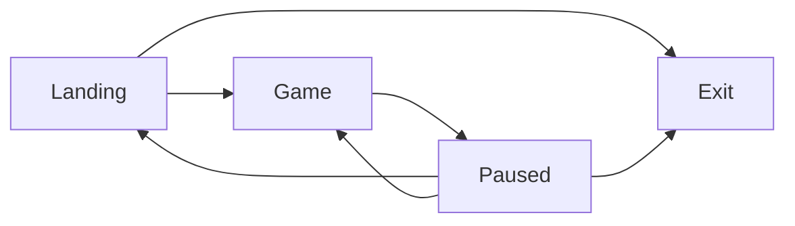
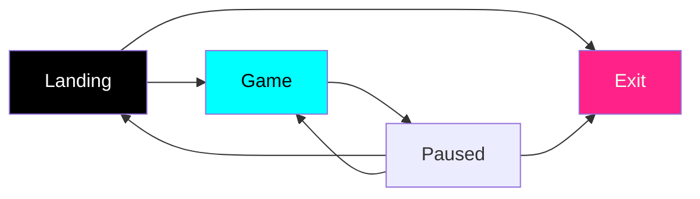
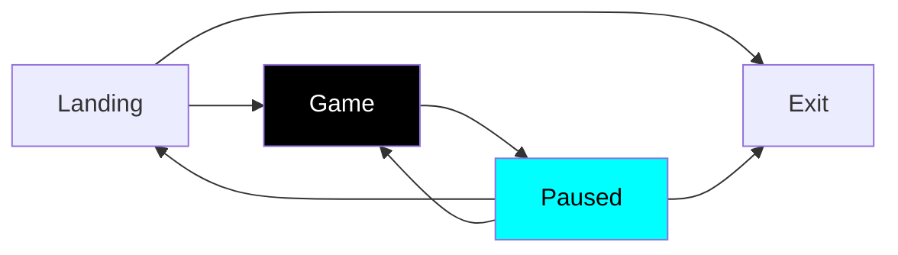
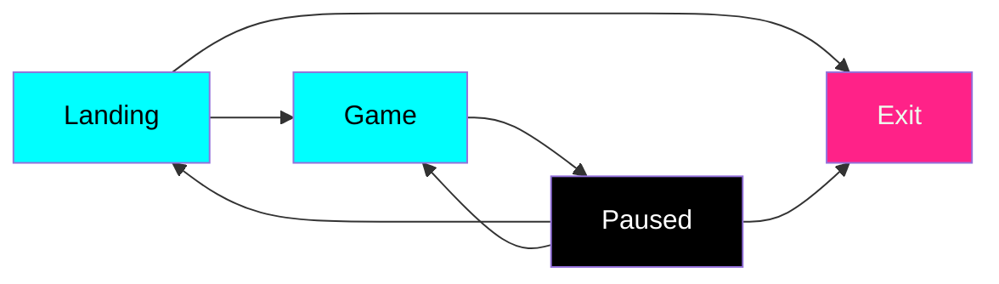
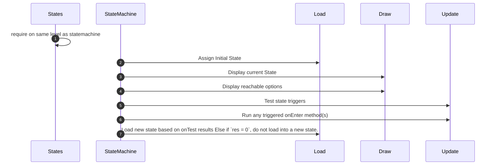

# In Development / Ideas

## Menu States 





State machine has no notion of Paused from this state



State Machine only knows paused state as reachable



Maximum # of options available when paused. Exit state has onTest defined as no-op, as there are no further states reachable. Hence `nodes = {}`, `text = {}`, `onTest = {}`. Only title and `onEnter` are defined.

>
> ```mermaid
> flowchart LR
> Landing --> Game & Exit
> Game --> Paused
> Paused --> Exit & Landing & Game
> Cursor ..->|"1st in iPairs(nodes)"| Landing & Game
> Cursor ..->|1st but unnecessary| Paused
> 
> ```
>
> ```lua
> -- Define States 'graph'
> cursor = 1 -- every time we load a new state
> states.landing.nodes = { states.game, states.exit }
> states.game.nodes = { states.paused }
> states.paused.nodes = { states.game, states.landing, states.exit }
>
> -- on up/down arrows
> cursor = cursor + 1 -- wraps to 1
> cursor = cursor - 1 -- wraps to #state.nodes
>
> -- on enter / a keys
> self.state = state.nodes[cursor]
> -- load (triggers state.triggers.onEnter)
> self:load()
> ```



```lua
local StateMachine = {
    states = {}
}

local isLoaded = false

function StateMachine:load(states)
    self.states = states
end

function StateMachine:next()
    -- -- reset available options
    -- self.options = {}
    -- -- set options for display
    -- for k, v in pairs(self.states) do
    --     table.insert(self.options, v.text)
    -- end
end

function StateMachine:update(dt)
    for k, v in pairs(states) do
        local res = v.trigger.onTest()
        if res > 0 then
            function()
                self:load(self.states[res])
            end
            -- v.trigger.onEnter(res)
        end
    end
end

return StateMachine
```

For StateMachine + States, something like...

```lua
local Joystick = require("core.input.joystick")
local Keyboard = require("core.input.keyboard")

-- Partial Definition for States
states = {
    landing = {
        nodes = {},
        triggerResult = 0
    }
    game = {
        nodes = {}, 
        triggerResult = 0
    }
    paused = {
        nodes = {}, 
        triggerResult = 0
    }
    exit = {}
}

-- Define States 'graph'
states.landing.nodes = {states.game, states.exit}
states.game.nodes = {states.paused}
states.paused.nodes = {states.game, states.landing, states.exit}

-- Define States 'contents'
states.landing.title = "Welcome to WamBam!"
states.landing.text = {"Start New Game", "Exit"}
states.landing.trigger = {
    onTest = function () 
        if Joystick.lastButton == "start" then
            return 1
        elseif Joystick.lastButton == "x" then
            return 2
        end
        if Keyboard.lastKey == "enter" then
            return 1
        elseif Keyboard.lastKey == "escape" then
            return 2
        end
        return 0
    end,
    onEnter = {
        function (window, world)

        end,
        function (window, world)
        end
    }
}

states.game.title = ""
states.game.text = {"Press Start/Esc to pause"}
states.game.trigger = {
    onTest = function()
        if Joystick.lastButton == "start" then
            return 1
        end
        if Keyboard.lastKey == "escape" then
            return 1
        end
        return 0
    end
}

states.paused.title = "Paused"
states.paused.text ={"Resume", "Exit to Menu", "Exit Game"}

```

## Menu (draw)

```lua
local text = love.graphics.newText(love.graphics.getFont(), nil)
local coloredText = { {1, 1, 1}, "Some Text", {0.4, 1, 1}, "Second Option"}
local x = window.right / 2 - len(word) * dpilike
local y = window.bottom / 2 - 20
text:add( coloredtext, x, y, ...)
```
