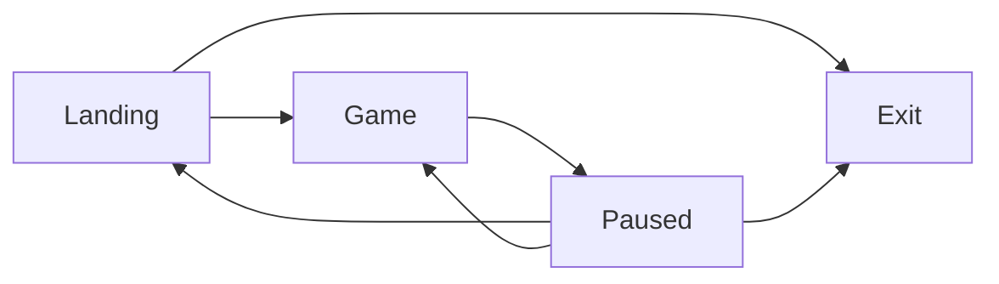

# In Development / Ideas

## Menu States 



```lua
states = {
    landing = {nodes = {}}
    game = {nodes = {}}
    paused = {nodes = {}}
    exit = {}
}

states.landing.nodes = {states.game, states.exit}
states.game.nodes = {states.paused}
states.paused.nodes = {states.game, states.landing, states.exit}

states.landing.title = "Welcome to WamBam!"
states.landing.text = {"Start New Game", "Exit"}

states.game.title = ""
states.game.text = {"Press Start/Esc to pause"}

states.paused.title = "Paused"
states.paused.text ={"Resume", "Exit to Menu", "Exit Game"}

```

## Menu (draw)

```lua
local text = love.graphics.newText(love.graphics.getFont(), nil)
local coloredText = { {1, 1, 1}, "Some Text", {0.4, 1, 1}, "Second Option"}
local x = window.right / 2 - len(word) * dpilike
local y = window.bottom / 2 - 20
text:add( coloredtext, x, y, ...)
```