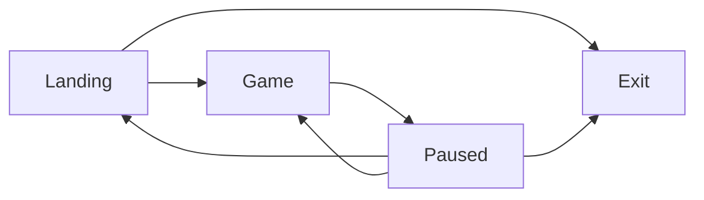
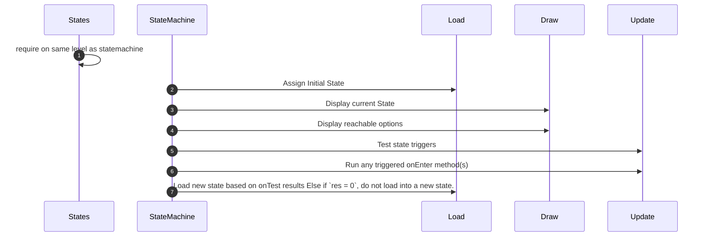

# In Development / Ideas

## Menu States 


>
>```mermaid
>flowchart LR
>Landing:::Current --> Game:::Next & Exit:::End
>Game --> Paused
>Paused --> Exit & Landing & Game
>
>classDef Current fill:black,color:white
>classDef Next fill:aqua,color:black
>classDef End fill:#f28,color:#efe
>```
>
>State machine has no notion of Paused from this state
>&nbsp;

>
>```mermaid
>
>flowchart LR
>Landing --> Game:::Current & Exit
>Game --> Paused:::Next
>Paused --> Exit & Landing & Game
>
>classDef Current fill:black,color:white
>classDef Next fill:aqua,color:black
>```
>
>State Machine only knows paused state as reachable
>&nbsp;


>```mermaid
>flowchart LR
>Landing --> Game & Exit:::End
>Game --> Paused:::Current
>Paused --> Exit & Landing:::Next & Game:::Next
>
>classDef Current fill:black,color:white
>classDef Next fill:aqua,color:black
>classDef End fill:#f28,color:#efe
>```
>
>Maximum # of options available when paused. Exit state has onTest defined as no-op, as there are no further states reachable. Hence `nodes = {}`, `text = {}`, `onTest = {}`. Only title and `onEnter` are useful.
> &nbsp;

>
> ```mermaid
> flowchart LR
> Landing --> Game & Exit
> Game --> Paused
> Paused --> Exit & Landing & Game
> Cursor ..->|"1st in iPairs(nodes)"| Landing & Game
> Cursor ..->|1st but unnecessary| Paused
> 
> ```
>
> ```lua
> -- Define States 'graph'
> cursor = 1 -- every time we load a new state
> states.landing.nodes = { states.game, states.exit }
> states.game.nodes = { states.paused }
> states.paused.nodes = { states.game, states.landing, states.exit }
>
> -- on up/down arrows
> cursor = cursor + 1 -- wraps to 1
> cursor = cursor - 1 -- wraps to #state.nodes
>
> -- on enter / a keys
> self.state = state.nodes[cursor]
> -- load (triggers state.triggers.onEnter)
> self:load()
> ```



For StateMachine + States, something like...

## Menu (state definitions)

```lua
-- Partial Definition for States
local states = {
    landing = {
        title = "landing",
        joyMap = "b",
        keyMap = "m",
        selected = false,
        nodes = {}
    },
    game = {
        title = "playing",
        joyMap = "start",
        keyMap = "escape",
        selected = true,
        nodes = {}
    },
    paused = {
        title = "paused",
        joyMap = "start",
        keyMap = "escape",
        selected = false,
        nodes = {}
    },
    exit = {
        title = "exit",
        joyMap = "x",
        keyMap = "q",
        selected = false,
        nodes = {}
    }
}

-- Define States 'graph'
states.landing.nodes = { states.game, states.exit } -- future home of settings?
states.game.nodes = { states.paused }
states.paused.nodes = { states.game, states.landing, states.exit }

-- Define States 'contents'
states.landing.images = { pausedImage, exitImage }
states.game.images = { pausedImage }
states.paused.images = { resumeImage, mainMenuImage, exitImage }

states.landing.text = { "Start New Game", "Exit" }
states.game.text = { "Press Start/Esc to pause" }
states.paused.text = { "Resume", "Exit to Menu", "Exit Game" }

states.landing.trigger = {
    onTest = { function()
        if CheckConsumeInput(states.game) then
            return 1
        end
        if CheckConsumeInput(states.exit) then
            return 2
        end
        return 0
    end },
    onEnter = function(window, world)
        print("LANDING")
    end
}
-- ... rest of trigger definitions
```

## Menu (update)

```lua
function StateMachine:update(dt)

    -- selection up/down (joystick only -- keyboard todo)
    if joystick.lastButton == "dpdown" then
        cursorNext(self.state.nodes)
        joystick.lastButton = "none"
    elseif joystick.lastButton == "dpup" then
        cursorPrev(self.state.nodes)
        joystick.lastButton = "none"
    end

    for k, node in ipairs(self.state.nodes) do
        if cursor == k then node.selected = true
        else node.selected = false
       end

        -- check for selection trigger aligned with cursor
        if joystick.lastButton == "a" then
            if node.selected then
                joystick.lastButton = "none"
                self.state = node
                self:load()
            end
        end

        -- check onTest for each reachable state
        for k1, nodeTest in pairs(self.state.trigger.onTest) do
            local res = nodeTest()
            if res > 0 then
                -- 'consume' the button input
                self.state = self.state.nodes[res]
                self:load()
                return self.state.title ~= states.paused.title and
                self.state.title ~= states.landing.title  -- decides if main updates
            end
        end
    end
    return self.state.title == states.game.title -- decides if main updates
end

return StateMachine
```

## Menu (draw)

```lua
function StateMachine:draw(window)
    local image = nil
    love.graphics.setColor(1, 1, 1, 1)
    if self.state.images then
        for i = 1, #self.state.images do
            image = self.state.images[i]
            menuShader:draw(image, window.right / 2 , 20 + 100   * i, self.state.nodes[i].selected)
        end
    end
end
```
